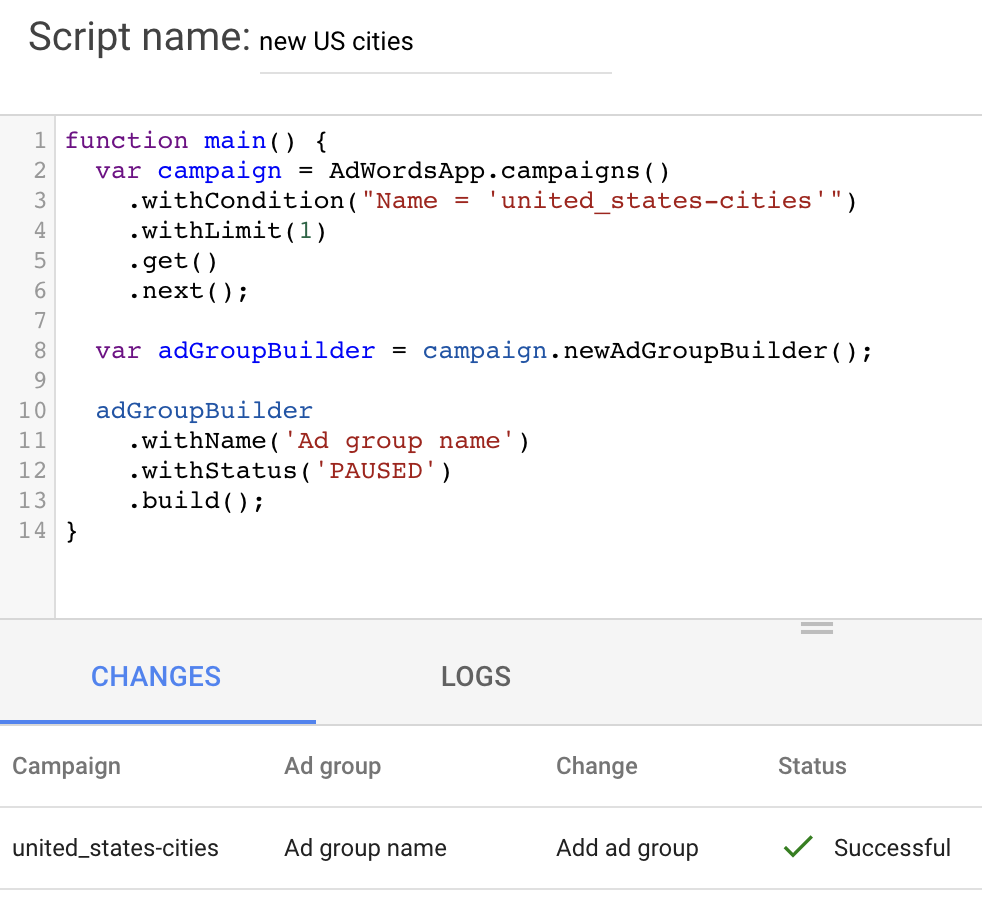
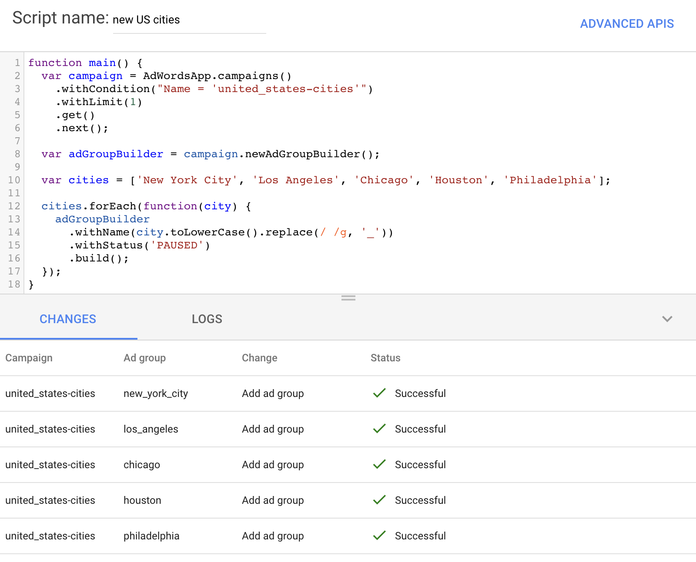
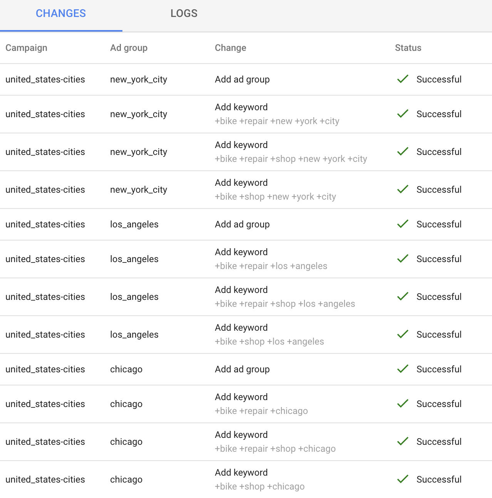
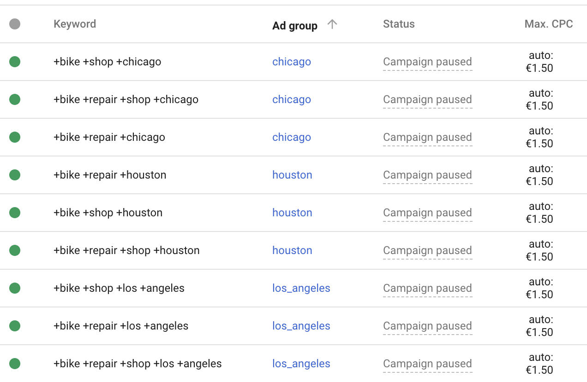
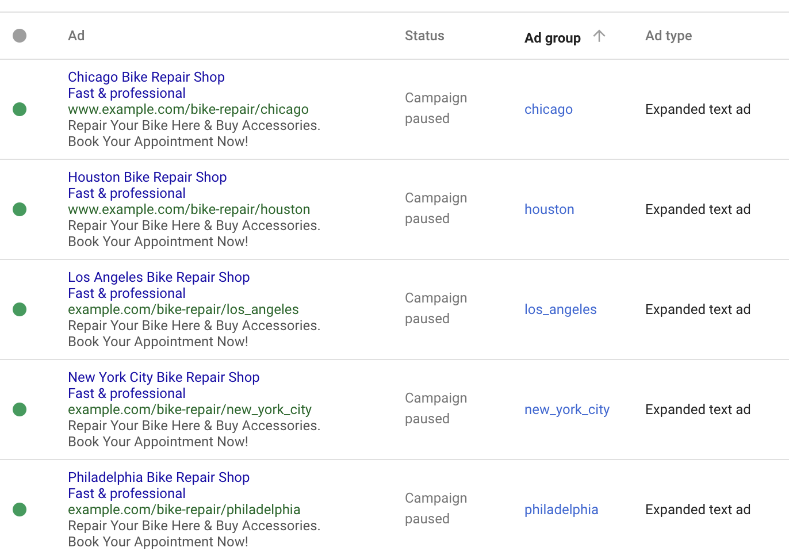

# How to create entities from AdWords Scripts
Today I'm going to introduce a new concept from AdWords Scripts: `Builders`!
For reasons unknown to me, builders are available for ad groups, keywords and ads but not campaigns...
Though I might share a few tricks with you later on how to circumvent that 😉.

__For the purpose of this tutorial, let's say we own bike repair shops in every major city in the United States and want to automatically generate ads for every single repair shop.__

Let's start off with a new script. I'll personally call it "new US cities".

# Building the ad groups
To create a new ad group, you need to first select a campaign. Campaigns can be selected by ID or by campaign name.

I went ahead and manually created a new search campaign called `united_states-cities` as AdWords won't allow us to create a campaign through AdWords Scripts yet. You can also use an existing campaign.

If you know the ID of your campaign (you can add `campaign ID` as a column in the AdWords interface) then that is the safest way to select a campaign while being sure you're not selecting anything else (which might happen if you have campaigns with similar names).
```javascript
var campaign = AdwordsApp.campaigns()
    .withIds([1374655888])
    .get()
    .next();
```

Selecting a campaign by name (less safe but more human-friendly):
```javascript
var campaign = AdWordsApp.campaigns()
    .withCondition("Name = 'united_states-cities'")
    .withLimit(1)
    .get()
    .next();
```
I threw a `javascript›.withLimit(1)` in there just to be sure we're only selecting one campaign.

Once we've selected the campaign in which we want to create our new ad groups, this is how adding a new ad group is done:
```javascript
var campaign = AdWordsApp.campaigns()
    .withCondition("Name = 'united_states-cities'")
    .withLimit(1)
    .get()
    .next();

 var adGroupBuilder = campaign.newAdGroupBuilder();

 adGroupOperation = adGroupBuilder
    .withName('Ad group name')
    .withStatus('PAUSED')
    .build();
```

I added `javascript›.withStatus('PAUSED')` as a safety measure to make sure we have time to review what we create before going live!

If you preview the above script in your `javascript›main()` function, for the first time you should see something in the CHANGES section:


As always, this is what our AdWords Script would do if it was actually run.

As a fake bike repair shop owner for the purpose of this tutorial, I have a list of cities where my shops are located that I want to advertise on Google Search. Lists (called arrays in JavaScript) are defined this way: `javascript›var cities = ['New York City', 'Los Angeles', 'Chicago', 'Houston', 'Philadelphia'];`

It is also possible to read such a list from a Google Spreadsheet but I'll leave that for another tutorial 😉.

We'd probably want to create an ad group for each of those cities:
```javascript
  var campaign = AdWordsApp.campaigns()
      .withCondition("Name = 'united_states-cities'")
      .withLimit(1)
      .get()
      .next();

  var adGroupBuilder = campaign.newAdGroupBuilder();

  var cities = ['New York City', 'Los Angeles', 'Chicago', 'Houston', 'Philadelphia'];

  cities.forEach(function(city) {
    adGroupBuilder
      .withName(city)
      .withStatus('PAUSED')
      .build();
  });
```

Now, that is all fine and dandy, but if you like standardization like me, you'll want to have ad groups that are more computer-readable, so for example, having `new_york_city` instead of `New York City` as an ad group name. We can simply lowercase the name and replace spaces with underscores (`javascript›city.toLowerCase().replace(/ /g, '_')`).


# 🙌

# Adding keywords to our ad groups
Keywords are built using the same technique as ad groups but with some specificities as keywords also hold a bid (usually CPC) and a URL if not set at the ad level.
```javascript
 var keywordOperation = adGroup.newKeywordBuilder()
    .withText('keyword')
    .withCpc(0.5)
    .withFinalUrl('https://www.example.com')
    .build();
 var keyword = keywordOperation.getResult();
 ```

 We have a few different ways to add keywords to the ad groups we previously created. After each ad group is created, we can add the keywords directly, or we can wait for all ad groups to be created before selecting them and adding all the keywords at the same time.

 I chose to follow the first solution but anything is possible!

First, we'll need to modify our previous script a bit to get the "result" (the newly created ad group) back through `javascript›.getResult()`. Afterwards, we'll need to decide what keywords we want to add. It is a good idea to use broad match modifiers (sometimes shortened as BMM) as AdWords might be a bit overzealous with regular broad match keywords. Here is a short list using Chicago as an example:
- +bike +repair +chicago
- +bike +repair +shop +chicago
- +bike +shop +chicago

Some keywords may overlap but we're going to maximize our Quality Score and win the most CPC bids this way.

Doesn't sound too complicated, except a lot of American city names include spaces (and I'm not even talking about French city names that can be hyphenated like Aix-en-Provence in France or Saint-Jérôme in Québec) but I have a trick to handle that. By prepending `+` before our keyword and replacing every space by `[space]+`, we should have our broad match modifier keyword.

Example: `javascript›Logger.log('+' + 'bike repair Chicago'.replace(/ /g, ' +'));` gets us `+bike +repair +chicago`!

I don't want to repeat myself so I'll put my list of keywords in a list that can be iterated on.

Also note that I won't include the entire code every time and will replace missing bits by "(...)". I will include a full final version at the end of this tutorial so don't worry.

```javascript
(...)

cities.forEach(function(city) {
  var adGroupOperation = adGroupBuilder
    .withName(city.toLowerCase().replace(/ /g, '_'))
    .withStatus('PAUSED')
    .build();

  var adGroup = adGroupOperation.getResult();

  var keywords = [
    'bike repair ' + city,
    'bike repair shop ' + city,
    'bike shop ' + city
  ];

  keywords.forEach(function(keyword) {
    adGroup.newKeywordBuilder()
      .withText('+' + keyword.toLowerCase().replace(/ /g, ' +'))
      .withCpc(1.5) // $/€/£1.50 bid as a placeholder
      .withFinalUrl('https://www.example.com')
      .build();
  });
});

(...)
```

Now take a look at the preview results.



# 😍

Improvements on this part of the script would be to include more keywords (like "bicycle shop" instead of only "bike shop") as well as adding phrase match keywords & exact match keywords but you should be able to figure it out 😉. Remember that AdWords can infer the match type through the keyword text, for example: `"bike repair shop chicago"` is a phrase match keyword and `[bike repair shop chicago]` is an exact match keyword so you only need to prepend and append either double quotes or square brackets around our keyword text template and that's it!

# Every ad campaign needs... Expanded Text Ads
You know the drill now! Expanded text ads have their own builder:
```javascript
 var adOperation = adGroup.newAd().expandedTextAdBuilder()
    .withHeadlinePart1('First ad headline')
    .withHeadlinePart2('Second ad headline')
    .withDescription('Ad description')
    .withPath1('path1')
    .withPath2('path2')
    .withFinalUrl('https://www.example.com')
    .build();
 var ad = adOperation.getResult();
```

Some stuff to keep in mind:
- Each headline has a 30 characters limit
- Description line has a 80 characters limit

After some customization, this is what our final script looks like:
```javascript
function main() {
  var campaign = AdWordsApp.campaigns()
      .withCondition("Name = 'united_states-cities'")
      .withLimit(1)
      .get()
      .next();

  var adGroupBuilder = campaign.newAdGroupBuilder();

  var cities = [
    'New York City',
    'Los Angeles',
    'Chicago',
    'Houston',
    'Philadelphia'
  ];

  cities.forEach(function(city) {
    var adGroupOperation = adGroupBuilder
      .withName(city.toLowerCase().replace(/ /g, '_'))
      .withStatus('PAUSED')
      .build();

    var adGroup = adGroupOperation.getResult();

    var keywords = [
      'bike repair ' + city,
      'bike repair shop ' + city,
      'bike shop ' + city
    ];

    keywords.forEach(function(keyword) {
      adGroup.newKeywordBuilder()
        .withText('+' + keyword.toLowerCase().replace(/ /g, ' +'))
        .withCpc(1.5)
        .withFinalUrl('https://www.example.com')
        .build();
    });

    adGroup.newAd().expandedTextAdBuilder()
      .withHeadlinePart1(city + ' Bike Repair Shop')
      .withHeadlinePart2('Fast & professional')
      .withDescription('Repair Your Bike Here & Buy Accessories. ' +
                       'Book Your Appointment Now!')
      .withPath1('bike-repair')
      .withPath2(city.toLowerCase().replace(/ /g, '_'))
      .withFinalUrl('https://www.example.com')
      .build()
  });
}
```

Go ahead and run it after making sure no errors occur during the preview.

# Results

## Keywords list:


## Ads list:


Pretty amazing that we created these ads automatically. It would be little to no effort to scale them to include any number of cities! Last step is to unpause your ad groups whenever you're ready to launch 🚀.
