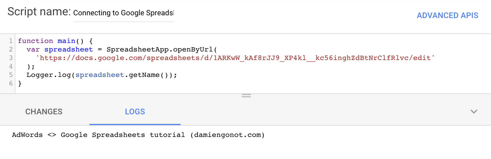
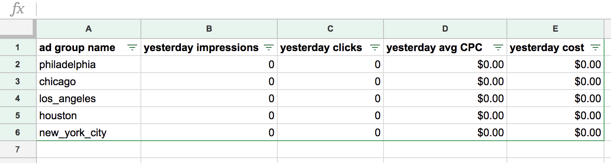
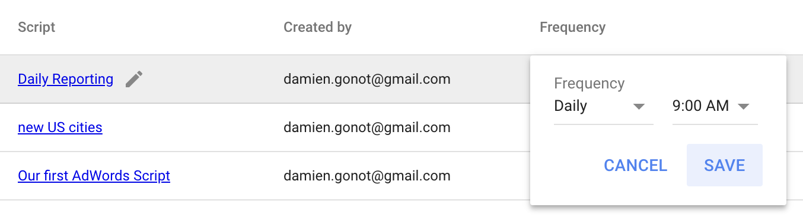

Today we'll learn one of the most powerful tools of AdWords Scripts: being able to read/write Google Spreadsheets data. It is definitely one of my favourite features and I am really excited to share this with you.

# How to read Google Spreadsheets data from AdWords Scripts
## Opening our spreadsheet
The first step in reading from Google Spreadsheets is to choose from which Spreadsheet we want to work from 🙂.
Hopefully, you already have a specific project/sheet in mind.

You can open a spreadsheet by either ID or URL:
- `javascript›SpreadsheetApp.openByID();`
- `javascript›SpreadsheetApp.openByUrl();`

There are no differences between the two, but I have a small preference for the later as it feels simpler and makes more sense to me.

Let's go ahead and do that. For the purpose of this tutorial I'll use this spreadsheet as an example: [https://docs.google.com/spreadsheets/d/1ARKwW\_kAf8rJJ9\_XP4kl\_\_kc56inghZdBtNrClfRlvc/edit](https://docs.google.com/spreadsheets/d/1ARKwW_kAf8rJJ9_XP4kl__kc56inghZdBtNrClfRlvc/edit).

```javascript
function main() {
  var spreadsheet = SpreadsheetApp.openByUrl(
    'https://docs.google.com/spreadsheets/d/1ARKwW_kAf8rJJ9_XP4kl__kc56inghZdBtNrClfRlvc/edit'
  );
  Logger.log(spreadsheet.getName());
}
```

If you run or preview this in AdWords Scripts, you'll notice we have to give additional permissions so that the script is able to run:


After this is done, you should be able to see your spreadsheet's name in the logs.


## Selecting a sheet
Spreadsheets can hold multiples sheets. We can select a sheet either by its name (`javascript›spreadsheet.getSheetByName('sheet_name')`) or its position (`javascript›spreadsheet.getSheets()[0]` for the first sheet, `javascript›spreadsheet.getSheets()[1]` for the second sheet...).

I'll use `javascript›.getSheetByName()` so that my script still works even if I re-order the sheets.

```javascript
function main() {
  var spreadsheet = SpreadsheetApp.openByUrl(
    'https://docs.google.com/spreadsheets/d/1ARKwW_kAf8rJJ9_XP4kl__kc56inghZdBtNrClfRlvc/edit'
  );

  Logger.log(spreadsheet.getName());

  var sheet = spreadsheet.getSheetByName('read');
  Logger.log(sheet.getSheetName());
}
```

This should log `read` as it is indeed the sheet we selected and are currently working on 👍.

## Reading values
Once again, we're offered many possibilities here!

A pretty straightforward solution is to use `javascript›sheet.getSheetValues(startRow, startColumn, numRows, numColumns)`. Keep in mind sheets rows and columns index starts at 1. A value -1 mean the last row or column with data. Hence getting the values for an entire sheet would be done this way: `javascript›sheet.getSheetValues(1, 1, -1, -1)`.

Another solution is to use `javascript›.getRange()` followed with `javascript›.getValues()` for a grid selection, or `javascript›.getValue()` for a single cell (or the first cell of the range). This function has a flexible number of arguments:
- `javascript›.getRange(a1Notation)`: uses the same notation you would use in a formula inside a spreadsheet, which may be the most natural for you. Examples: `javascript›sheet.getRange('A1').getValue()` gets you the content of the first (A1) cell, `javascript›sheet.getRange('A1:A5').getValues()` gets you the content of the first 5 rows of the first column, `javascript›sheet.getRange('A1:C10').getValues()` gets you the content of the `A1:C10` grid.
- `javascript›.getRange(row, column)`: for a single cell. Example: `javascript›sheet.getRange(1, 1).getValue()` to get the value of the first cell (first column, first row) of the sheet. Corresponds to the A1 cell.
- `javascript›.getRange(row, column, numRows)`: for a "vertical" selection. Example: `javascript›sheet.getRange(2, 1, 4).getValues()` to get the values of the first column, starting from the second row, up until row 5.
- `javascript›.getRange(row, column, numRows, numColumns)`: same principle as for `javascript›.getSheetValues`.

## Real-life example
Remember my fake bike repair shops from the [Programmatically Create Ads](/blog/adwords-scripts-create-ads) article?

I hardcoded the list of shops/cities inside the script but now we'd be able to read that data directly from a spreadsheet!

In my [example spreadsheet](https://docs.google.com/spreadsheets/d/1ARKwW_kAf8rJJ9_XP4kl__kc56inghZdBtNrClfRlvc/edit), I have data in A1:C6 with shop name in column A, the city name in column B and the population of the city in column C and with headers on the first row. Let's read all of this:
```javascript
function main() {
  var spreadsheet = SpreadsheetApp.openByUrl(
    'https://docs.google.com/spreadsheets/d/1ARKwW_kAf8rJJ9_XP4kl__kc56inghZdBtNrClfRlvc/edit'
  );

  var sheet = spreadsheet.getSheetByName('read');

  var data = sheet.getSheetValues(2, 1, -1, -1);
  Logger.log(data);
}
```

Result:
```
[[NYCycle, New York City, 2.0320876E7], [Angel'bikes, Los Angeles, 1.3131431E7], [Chicago Bike Shop, Chicago, 9512999.0], [Houston Cycle, Houston, 6313158.0], [Phillie Bikes, Philadelphia, 6096120.0]]
```

As you can see we got an array of array back. Let's iterate over the main array and assign values to make everything looks simpler:
```javascript
function main() {
  var spreadsheet = SpreadsheetApp.openByUrl(
    'https://docs.google.com/spreadsheets/d/1ARKwW_kAf8rJJ9_XP4kl__kc56inghZdBtNrClfRlvc/edit'
  );

  var sheet = spreadsheet.getSheetByName('read');

  var data = sheet.getSheetValues(2, 1, -1, -1);

  data.forEach(function(row) {
    var city = row[1];
    Logger.log(city);
  });
}
```

Result:
```
New York City
Los Angeles
Chicago
Houston
Philadelphia
```

Amazing! Now it would be possible to combine this script and the [Programmatically Create Ads](/blog/adwords-scripts-create-ads) one to automatically create ads based on data from a spreadsheet!

# How to write data from AdWords Scripts to Google Spreadsheets
I'm going to re-use knowledge from [AdWords Scripts: Reading Data](/blog/adwords-scripts-reading-data) to read ad group data from a specific campaign and write it to our [example spreadsheet](https://docs.google.com/spreadsheets/d/1ARKwW_kAf8rJJ9_XP4kl__kc56inghZdBtNrClfRlvc/edit).

Let's put all of that data in an array first. We can iterate through the array and push every ad group name and id in the array. I initiated the data array with column headers.

```javascript
function main() {
  var spreadsheet = SpreadsheetApp.openByUrl(
    'https://docs.google.com/spreadsheets/d/1ARKwW_kAf8rJJ9_XP4kl__kc56inghZdBtNrClfRlvc/edit'
  );

  var sheet = spreadsheet.getSheetByName('write');

  var adGroups = AdWordsApp
    .adGroups()
    .withCondition('CampaignName = "united_states-cities"')
    .get();

  var data = [['ad group name',
               'yesterday impressions',
               'yesterday clicks',
               'yesterday avg CPC',
               'yesterday cost'
              ]];

  while (adGroups.hasNext()) {
    var adGroup = adGroups.next();
    data.push([
      adGroup.getName(),
      adGroup.getStatsFor("YESTERDAY").getImpressions(),
      adGroup.getStatsFor("YESTERDAY").getClicks(),
      adGroup.getStatsFor("YESTERDAY").getAverageCpc(),
      adGroup.getStatsFor("YESTERDAY").getCost()
    ]);
  }

  Logger.log(data);
}
```

`javascript›.getStatsFor(date_range)` is a useful method to get statistical data for a specific date range. Other date ranges like `LAST_7_DAYS` or `LAST_MONTH` can be used.

Result:
```
[[ad group name, yesterday impressions, yesterday clicks, yesterday avg CPC, yesterday cost], [philadelphia, 0, 0, 0.0, 0.0], [chicago, 0, 0, 0.0, 0.0], [los_angeles, 0, 0, 0.0, 0.0], [houston, 0, 0, 0.0, 0.0], [new_york_city, 0, 0, 0.0, 0.0]]
```

This is from a paused campaign so every stat is at 0 but you should see your real-life numbers. Our data is now well structured. The last step is to write the data in the sheet by adding `javascript›.setValues()` at the end.

## Final script
```javascript
function main() {
  var spreadsheet = SpreadsheetApp.openByUrl(
    'https://docs.google.com/spreadsheets/d/1ARKwW_kAf8rJJ9_XP4kl__kc56inghZdBtNrClfRlvc/edit'
  );

  var sheet = spreadsheet.getSheetByName('write');

  var adGroups = AdWordsApp
    .adGroups()
    .withCondition('CampaignName = "united_states-cities"')
    .get();

  var data = [['ad group name',
               'yesterday impressions',
               'yesterday clicks',
               'yesterday avg CPC',
               'yesterday cost'
              ]];

  while (adGroups.hasNext()) {
    var adGroup = adGroups.next();
    data.push([
      adGroup.getName(),
      adGroup.getStatsFor("YESTERDAY").getImpressions(),
      adGroup.getStatsFor("YESTERDAY").getClicks(),
      adGroup.getStatsFor("YESTERDAY").getAverageCpc(),
      adGroup.getStatsFor("YESTERDAY").getCost()
    ]);
  }

  Logger.log(data);

  sheet
    .getRange(1, 1, data.length, data[0].length)
    .setValues(data);
}
```

I'm using the length of the array and the length of the first element of the array to automatically know which range to select as the data "grid" and the range has to be of the exact same size.

Just a warning that previewing the script will actually write the data in the spreadsheet! So be careful.

## Spreadsheet Result


This is really useful to have your own custom dashboard right in Google Spreadsheets. If you want to have this data updated automatically every day, I would suggest turning on daily updates through AdWords Scripts' frequency feature available on the AdWords Scripts homepage:


**Your spreadsheet will now be updated every day at your desired time with your campaigns/ad groups data!**
