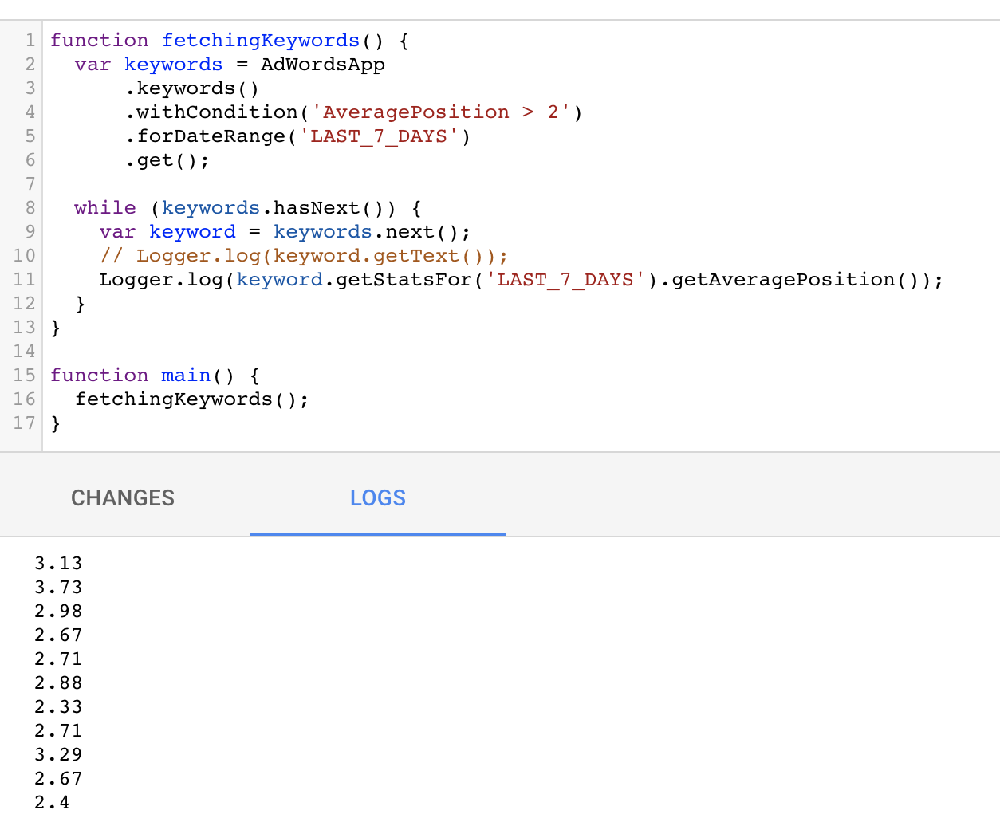
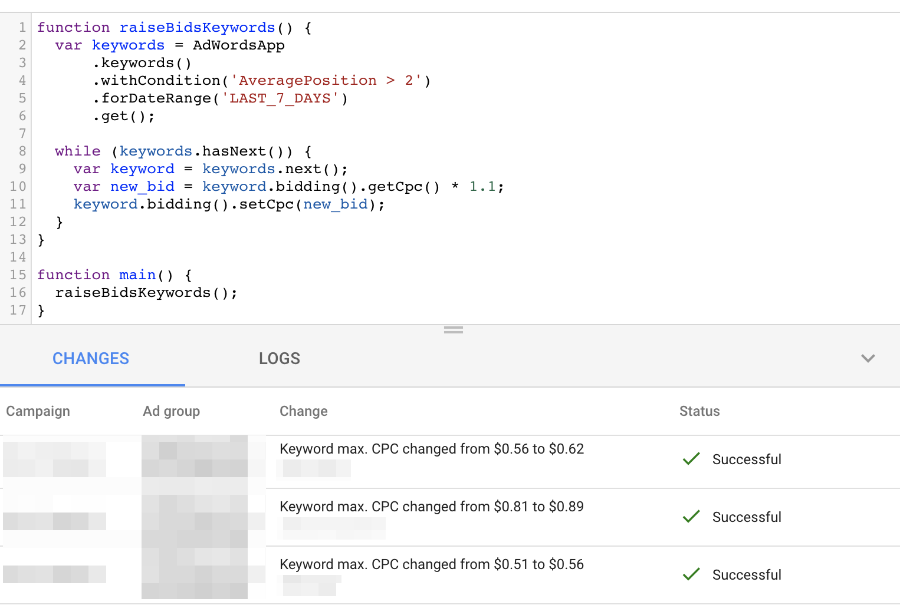
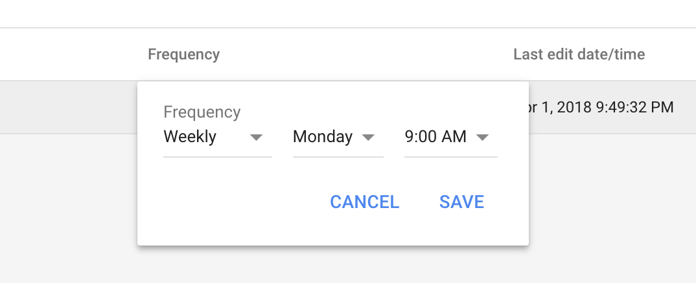

# How to modify entities from AdWords Scripts?
In the [AdWords Scripts: Reading Data](/blog/adwords-scripts-reading-data), we saw how to read data in AdWords Script.
Now we'll see how to take actions and modify ad entities (ad groups, keywords, ads...).
For example, this would allow us to automate the recurring optimization we might be doing every day, every week or every month.

Here are a few examples:
- Read over all the keywords and lower Cost Per Clicks (CPCs) for the keywords that have a Cost Per Action (CPA) over a certain threshold.
- Update the copy of all ads that match a certain template.
- etc..

We are going to implement a slightly different version of the first example.

# Raising bids on specific keywords
Imagine we have big pockets and want to stay in position 2 or better at all times for all keywords.
First, we'll need to find all keywords with an average position (avg. pos.) worse than 2.
This should be easy to do thanks to what we've learnt in the [previous tutorial](/blog/adwords-scripts-reading-data).
Then, we'll raise the bids on those keywords by an arbitrary amount (+10%) in order to try to raise the avg. pos. to 2 or better.

## Fetching keywords with a specific average position
In order to combine the `javascript›.withCondition()` method with a statistic (like `Average Position`) we have to precise a date range with `javascript›.forDateRange()`.
AdWords provide a few ready-to-use ranges such as `YESTERDAY`, `LAST_7_DAYS`, `LAST_30_DAYS`...
The complete list of ranges can be found [here](https://developers.google.com/adwords/scripts/docs/reference/adwordsapp/adwordsapp_keywordselector#forDateRange_2).
A custom `dateFrom` and `dateTo` at the `YYYYMMDD` format can also be used (example: `javascript›.forDateRange('20180401', '20180410')` for the first 10 days of April 2018).
We'll use `LAST_7_DAYS` this time.
```javascript
function fetchingKeywords() {
  var keywords = AdWordsApp
      .keywords()
      .withCondition('AveragePosition > 2')
      .forDateRange('LAST_7_DAYS')
      .get();
}
```

In order to test the `javascript›.withCondition()` method is working, we can read the avg. pos. of the result using `javascript›keyword.getStatsFor('LAST_7_DAYS').getAveragePosition()`.
Obviously, same date range has to be used or results would differ.

```javascript
function fetchingKeywords() {
  var keywords = AdWordsApp
      .keywords()
      .withCondition('AveragePosition > 2')
      .forDateRange('LAST_7_DAYS')
      .get();

  while (keywords.hasNext()) {
    var keyword = keywords.next();
    Logger.log(keyword.getText());
    Logger.log(keyword.getStatsFor('LAST_7_DAYS').getAveragePosition());
  }
}

function main() {
  fetchingKeywords();
}
```

Now, I commented out the `javascript›keyword.getText()` log in order to protect the private information of the client I was trying this script on, but we can see that all the keywords have indeed an avg. pos. of 2 or worse:


## Raising max CPCs on keywords
Let's take care of the bids now! It's pretty straightforward to do so by using `javascript›.bidding().setCpc()` on the `keyword` entity, but first, we need to get the current max CPC to calculate the new bid (remember we want to raise the bids by 10%). This is done by using `javascript›.bidding().getCpc()`. With all this knowledge, final formula is very simple:
```javascript
  var new_bid = keyword.bidding().getCpc() * 1.1;
  keyword.bidding().setCpc(new_bid);
```

This could have fit on one line but putting the calculated bid in its own variable allows for more readability.

I also changed the name of our function as it now not only fetches the keywords but also changes the bids.

```javascript
function raiseBidsKeywords() {
  var keywords = AdWordsApp
      .keywords()
      .withCondition('AveragePosition > 2')
      .forDateRange('LAST_7_DAYS')
      .get();

  while (keywords.hasNext()) {
    var keyword = keywords.next();
    var new_bid = keyword.bidding().getCpc() * 1.1;
    keyword.bidding().setCpc(new_bid);
  }
}

function main() {
  raiseBidsKeywords();
}
```

Now, if you press the preview button, for the first time you'll see some stuff appear in the __Changes__ section! Don't worry, changes haven't been made yet, AdWords is only showing you what the changes would be if you actually run the script.


The last step is to press on __Run__ instead of Preview. Be careful, this will change max CPCs in your real account.

__Congrats, your AdWords Script made changes on your behalf!__

 Now that we're happy with our script since it looks back on the past 7 days data, wouldn't it be nice if it ran on a weekly basis? On the AdWords Scripts list, you can set the frequency to weekly and choose the day of the week and time that suits you:

