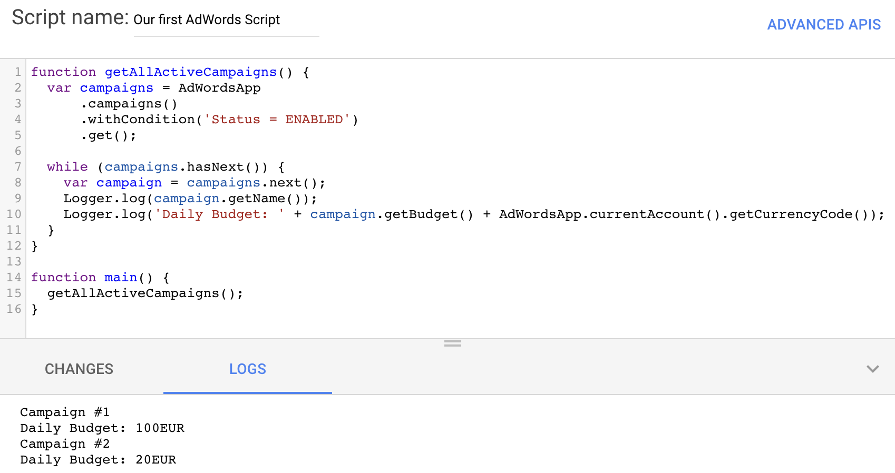
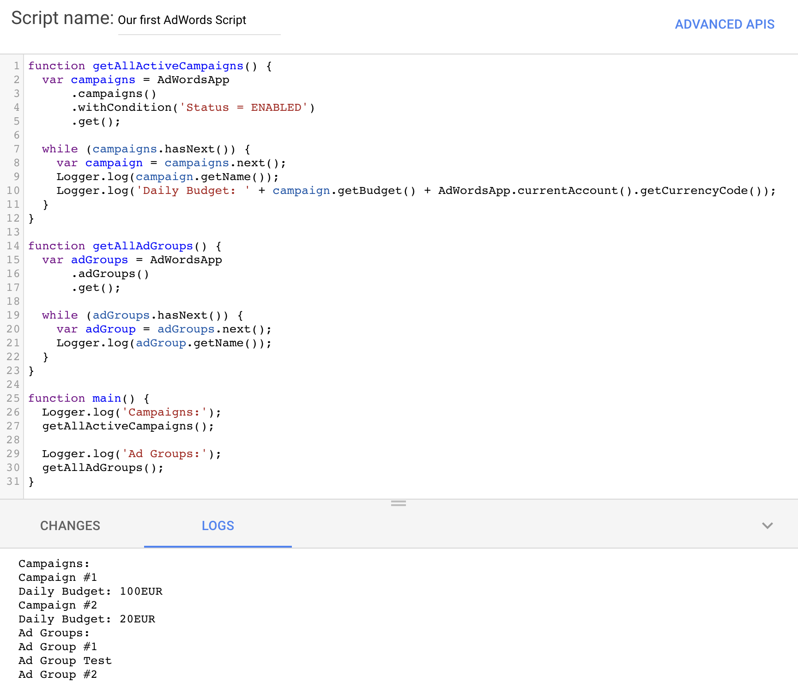

# How to read data from AdWords Scripts?
In the [brief introduction to AdWords Scripts](/blog/brief-introduction-to-adwords-scripts), we saw how to create our first AdWords Script. Now we'll try to do something useful with it. One of the first steps is to learn how to read campaigns data from AdWords Scripts.

## Getting a list of running campaigns
To get a list of campaigns, we'll use [`javascript›AdWordsApp.CampaignSelector`](https://developers.google.com/adwords/scripts/docs/reference/adwordsapp/adwordsapp_campaignselector). As a very basic first example, we'll try to fetch all of our *running* campaigns.

First of all, to structure our code a bit, we'll create a function outside of `javascript›main()`. We can call it `javascript›getAllActiveCampaigns()` and declare it that way: `javascript›function getAllActiveCampaigns() {}`. Remember that only what's inside `javascript›main()` will run, so we'll have to call `javascript›getAllActiveCampaigns()` inside it later but we'll omit it for now.

`javascript›AdWordsApp.campaigns().get()` is going to fetch *all* campaigns. If we want to be able to re-use it, we have to store it in a variable:

```javascript
function getAllActiveCampaigns() {
  var campaigns = AdWordsApp.campaigns().get();
}
```

But remember that we only want *running* campaigns. We can use `javascript›.withCondition()` to introduce filtering:

```javascript
function getAllActiveCampaigns() {
  var campaigns = AdWordsApp
      .campaigns()
      .withCondition('Status = ENABLED')
      .get();
}
```

Note the line indentation introduced for more readability. It is 100% optional but very recommended.

Other examples of conditions may be: `javascript›.withCondition('Impressions > 1000')`, `javascript›.withCondition("Name CONTAINS 'Canada'")`... Those conditions are also chainable.

In order to help us, AdWords is returning a few helpers alongside the list of campaigns we fetched. It can be really helpful to loop over the results. Here is an example with a `javascript›while() {}` loop, along with AdWords Scripts' `javascript›.next()` and `javascript›.hasNext()` helpers:
```javascript
function getAllActiveCampaigns() {
  var campaigns = AdWordsApp
      .campaigns()
      .withCondition('Status = ENABLED')
      .get();

  while (campaigns.hasNext()) {
    var campaign = campaigns.next();
  }
}
```

Now if you try to run this, it wouldn't do anything, because the loop is basically empty. Let's log the name of the campaign: `javascript›Logger.log(campaign.getName());`.

Let's try to do a bit more. Campaign budget can be easily fetched with `javascript›.getBudget()` but it only returns an integer (for example, for a budget of $100, response will be 100), so let's try to get the currency code too. `javascript›AdWordsApp.currentAccount().getCurrencyCode()` should do!

Here is the final result:
```javascript
function getAllActiveCampaigns() {
  var campaigns = AdWordsApp
      .campaigns()
      .withCondition('Status = ENABLED')
      .get();

  while (campaigns.hasNext()) {
    var campaign = campaigns.next();
    Logger.log(campaign.getName());
    Logger.log('Daily Budget: ' + campaign.getBudget() + AdWordsApp.currentAccount().getCurrencyCode());
  }
}

function main() {
  getAllActiveCampaigns();
}
```

In the AdWords Scripts interface, your *running* campaigns and with their respective budgets should appear:


(Obviously, your own results will differ from mine 😊).

## Getting a list of ad groups
From what we've just learnt with how to read campaigns above, getting a list of ad groups will be really easy. We only need to switch `javascript›AdWordsApp.campaigns()` with `javacript›AdWordsApp.adGroups()` as well as some variables' names.
```javascript
function getAllAdGroups() {
  var adGroups = AdWordsApp
      .adGroups()
      .get();

  while (adGroups.hasNext()) {
    var adGroup = adGroups.next();
    Logger.log(adGroup.getName());
  }
}
```

As budgets are placed on a campaign level, you would get an error trying to run `javascript›adGroup.getBudget()` so I simply ommited it here.


## Getting a list of ads inside an ad group
Same thing with ads, we can simply replace `javascript›AdWordsApp.adGroups()` by `javascript›AdWordsApp.ads()`. But let's do things a bit differently this time. Let's get the ads inside a specific ad group.

We can simply select an ad group by its name with `javascript›.withCondition()`. `javascript›if (adGroup.hasNext()) {}` condition is present in case our "search" didn't result any ad group. After that, we can log the part 1 & part 2 headlines (in the case of Expanded text ads).
```javascript
function getAdsInAdGroup() {
  var adGroup = AdWordsApp
      .adGroups()
      .withCondition("Name = 'Ad Group #1'")
      .get();

  if (adGroup.hasNext()) {
    var ads = adGroup.next().ads().get();
    while (ads.hasNext()) {
      var ad = ads.next();
      Logger.log(ad.getHeadlinePart1());
      Logger.log(ad.getHeadlinePart2());
    }
  }
}
```

__You should now be comfortable reading campaigns, ad groups & ads from AdWords Scripts!__
