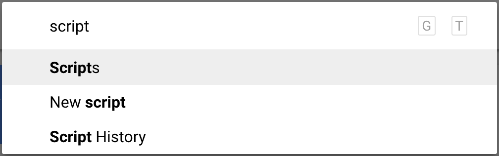
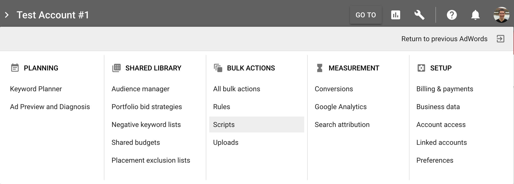
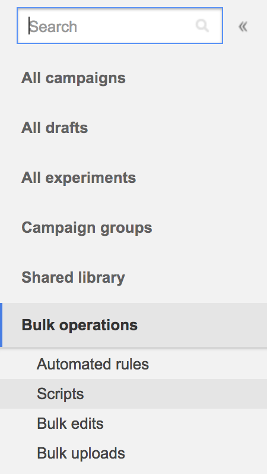
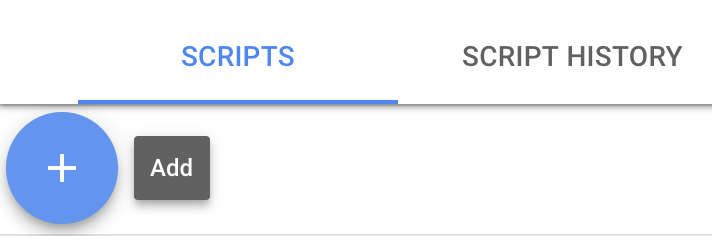
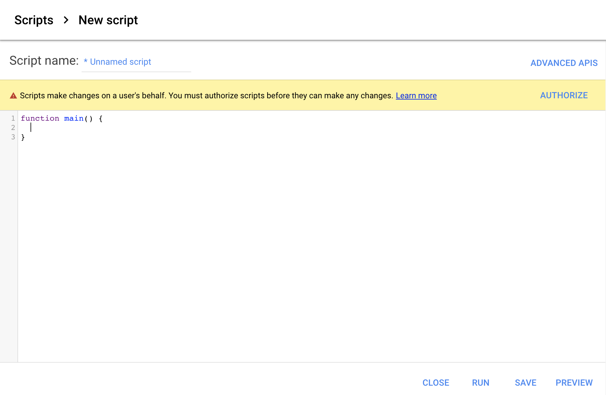
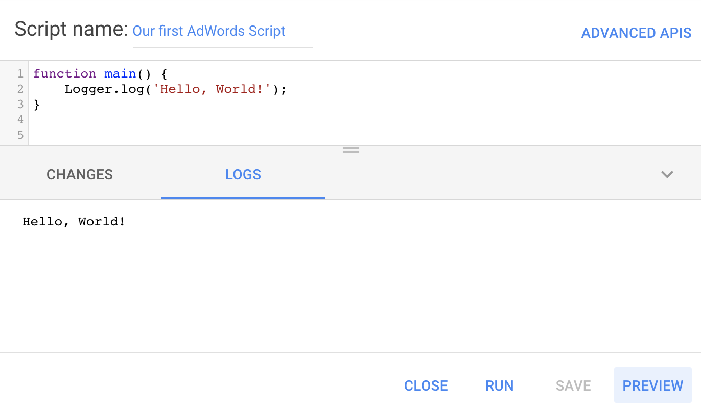

# What is AdWords Scripts?
AdWords Scripts is a way to automate AdWords campaigns by using a slightly modified version of JavaScript to read, create, update and delete AdWords "entities" (campaigns, ad groups, keywords, ads...). AdWords Scripts are hosted directly inside AdWords and you don't need a server to run them, AdWords takes care of everything for you.

Let's create our first AdWords Script now!

## How to access it?
### Using the new AdWords interface
The easiest way is to take advantage of AdWords' new shortcut feature: by typing <kbd>gt</kbd> anywhere in the interface. After the search prompt appears, simply search for "scripts" and press <kbd>Enter</kbd>.


Or going through the actual interface menus, click on the wrench icon in the top-right corner and you'll find "Scripts" in the "Bulk actions" section.


### Using the old AdWords interface
If you're not using the new AdWords interface, you can find Scripts in the left-hand side menu under the "Bulk operations" section.


I'll use the newer AdWords interface out of convenience for the rest of the tutorial.

# Our first AdWords Script
If you've never used AdWords Scripts before, your list of scripts should be empty. You can create a first one by clicking on the big circled "+" button.

This is what you should see:

You can name it however you want. I will name mine "Our first AdWords Script". An asterisk (\*) before the script name indicates that there are unsaved changes.

You can ignore the "Advanced APIs" button for now as it is used only to connect to other Google Services like BigQuery etc...

That big scary warning on a yellow background is letting us know we need to authorize the script before it can take actions on our AdWords account. It is safe to go ahead and authorize it now as our script is not doing anything yet. We might need to re-authorize it in the future if we connect the script to read/write data to Google Spreadsheets for example.

Below that is a big (almost) empty canvas where magic will happen.

```javascript
function main() {
}
```

We must write code inside the `javascript›main()` function for it to run. It is customary to try a new programming language/interface by writing a ["Hello, World!" program](https://en.wikipedia.org/wiki/%22Hello,_World!%22_program) that simply prints `Hello, World!`. In a normal JavaScript application, this would be `javascript›console.log("Hello, World!");` but because AdWords Scripts is a bit different from JavaScript, our program becomes `javascript›Logger.log("Hello, World!");`. Please note that single quotes (`'`)  can be used instead of double quotes (`"`), it is just a matter of personal preferences. I will use single quotes for the rest of the tutorial because this is what I prefer.

Here is what you should have now:
```javascript
function main() {
  Logger.log('Hello, World!');
}
```

You can go ahead and press the Preview button. It will automatically save your script and run it in preview mode. When scripts are run in "Preview", they don't actually run against your AdWords account and don't make any changes yet. Only when you press the Run button your scripts will modify the actual AdWords account. For now, we'll only use Preview.

You'll see that the Changes section stays empty. That's because we haven't done any actions on our AdWords entities yet and have only played with the Logs. So click on the Logs section and this is what you should see:


__Congrats! You've run your first AdWords script!__

You can continue learning more about AdWords Scripts by reading my next article: [AdWords Scripts: Reading Data](/blog/adwords-scripts-reading-data).
