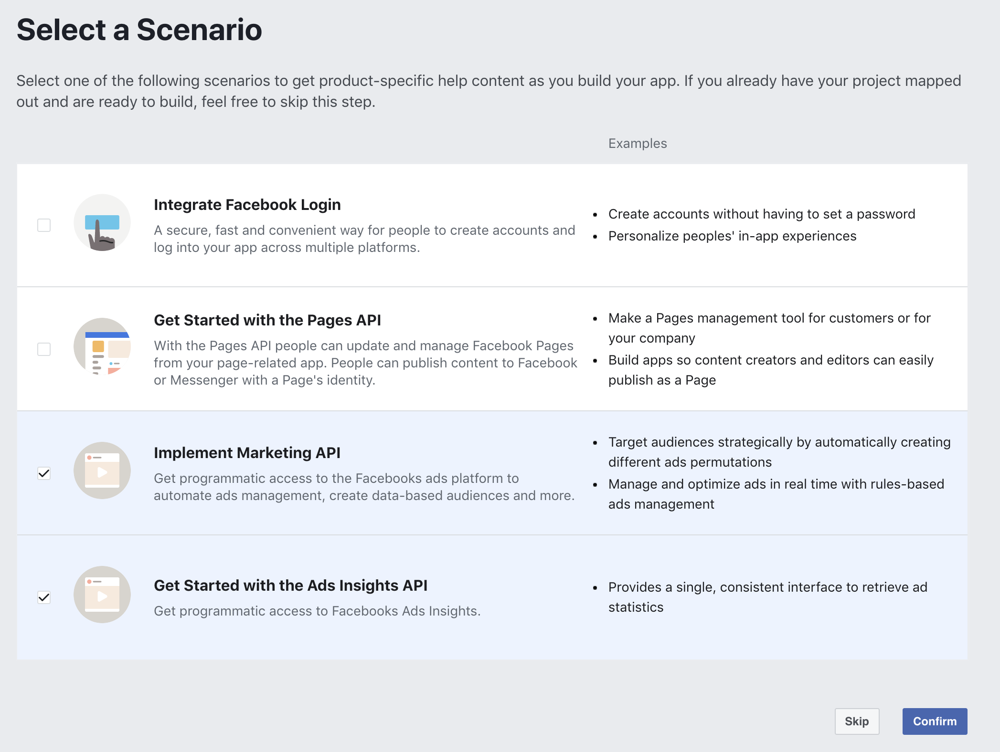
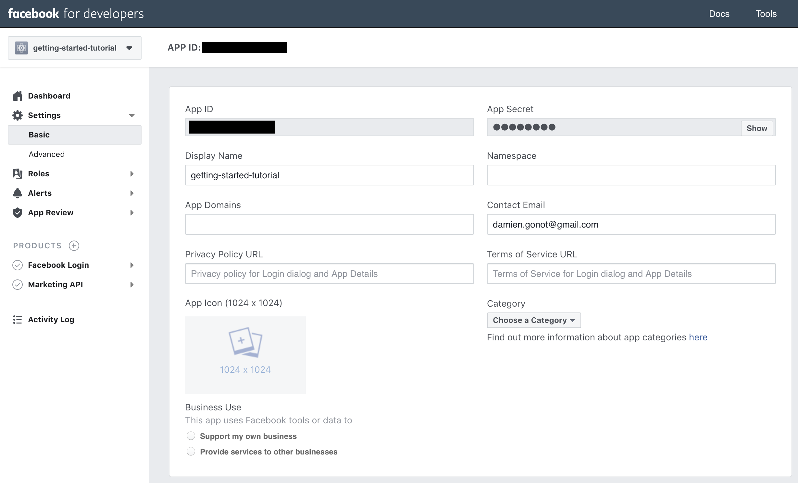
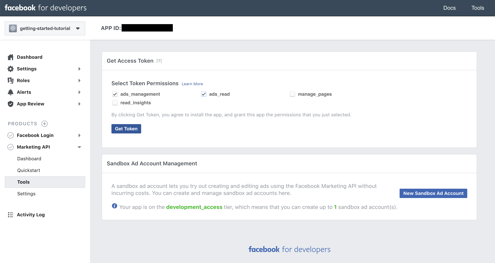
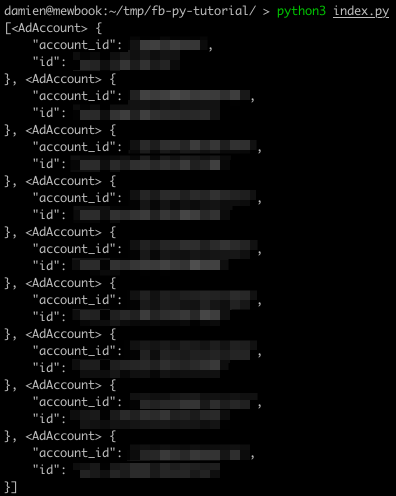

# What is Facebook Marketing API?
Facebook Marketing API is a way to automatically create, read, modify and delete campaigns, ad sets, ads, creatives & more on Facebook's advertising platform, which covers Facebook "feed", Facebook Messenger, Instagram (stories & feed) etc... using your favourite programming language.

[Read more about it on Facebook website](https://developers.facebook.com/docs/marketing-apis/).

# Generating an Access Token
Go to [https://developers.facebook.com/docs/marketing-apis/](https://developers.facebook.com/docs/marketing-apis/) and follow the steps to create a new Ads App. Make sure you select "Implement Marketing API" and "Get Started with the Ads Insights API" as shown below.



You should then be able to go to your ads page through [https://developers.facebook.com/apps/](https://developers.facebook.com/apps/).

Navigate to Settings > Basic. Copy and paste your App ID and App Secret somewhere safe.



Navigate to Products > Marketing API > Tools. Select `ads_management` and `ads_read`. Click on Get Token. Your access token will appear on the screen. Copy and paste it somewhere safe.



You will need these credentials throughout this tutorial. Make sure no one else can have access to your access token as it can be used to read, create, modify and delete any ads in your ad accounts.

# Our First Facebook Marketing API Request
A great way to interact with the Facebook Marketing API is through the official [`facebook-python-business-sdk` Python package](https://github.com/facebook/facebook-python-business-sdk). Other similar packages are available for Ruby, Node.js etc... but I will be using Python in this tutorial.

You can install the package by running `pip3 install facebook_business` in a terminal (the package used to be distributed through the name `facebookads` so make sure you're using the newer `facebook_business`). If you don't have experience with `pip`, I suggest you read [the official Python documentation about installing packages](https://packaging.python.org/tutorials/installing-packages/).

Here is a code sample showcasing basic authentication with the API and printing a list of your Facebook ad accounts.

```python
from facebook_business.api import FacebookAdsApi
from facebook_business.adobjects.user import User

app_id = 'REPLACE_BY_YOUR_APP_ID'
app_secret = 'REPLACE_BY_YOUR_APP_SECRET'
access_token = 'REPLACE_BY_YOUR_ACCESS_TOKEN'

FacebookAdsApi.init(app_id, app_secret, access_token)

me = User(fbid='me')
my_accounts = list(me.get_ad_accounts())
print(my_accounts)
```

Save it under `index.py` (for example) and run it. You should see something similar appear in your terminal:



🚀 Congrats! You've run your first Facebook Marketing API-based script.

(Of course I have many Facebook ad accounts but it's perfectly normal if you only have one.)

This isn't really exciting stuff yet as we're only accessing basic information for now but stay tuned for more articles on this blog about what you can do with the Facebook Marketing API.
