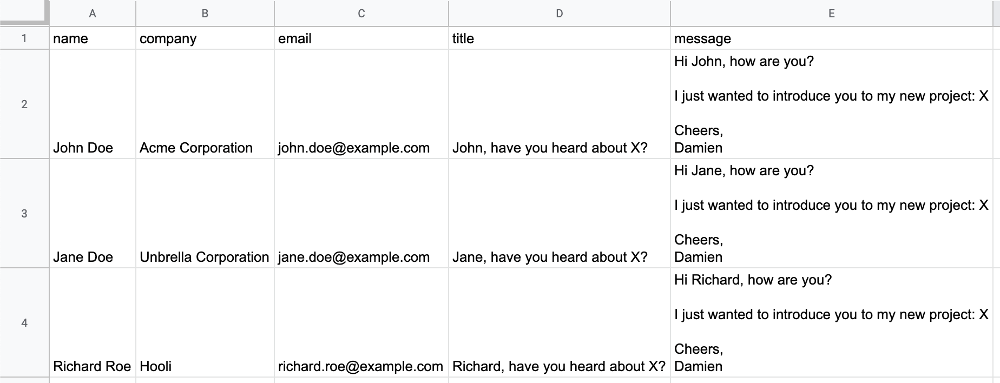
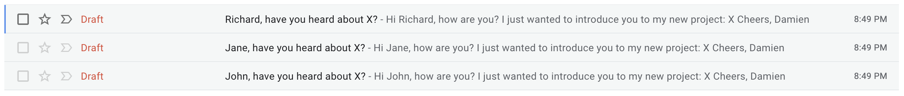

# Introduction
Did you know it was possible to send free emails directly from Google Spreadsheets?

Whether you're a small business owner looking to send updates about your product to your user base, a marketer looking for a free newsletter solution or a startup looking to bootstrap your sales emails without an expensive CRM, this article is made for you.

# Spreadsheet Setup
[Here is a sample sheet I'll use as an example](https://docs.google.com/spreadsheets/d/1Jg9fIoUMBI75eDGbEJGevcU2HHH59hTlK-v0k_A8Al4/edit?usp=sharing).



Feel free to duplicate it by clicking on __File > Make a copy__.

You can also create a new Google Spreadsheet (fastest way to is head to [sheet.new](https://sheet.new)) if you want to start fresh.

__Columns A, B and C__ are pretty self-explanatory. You should replace the fictitious names & emails with the real data you have about the people you want to send emails to.

__Column D__ is a template for our email title: `=CONCATENATE(INDEX(SPLIT(A2, " "), 1), ", have you heard about X?")`.

`INDEX(SPLIT(A2, " "), 1)` means: "take the value in `A2`, split it by space, and take the first element from that split". This is because we have a single column for "name" and it allows us to address the recipient by their first name only. If you have separate columns for first name and last name, this wouldn't be necessary but the code would still work (unless your recipient has a space in their first name).

`CONCATENATE()` allows to merge that first name we created from the full name column with the rest of our title template.

Similar thing in __Column E__ with a twist: it would be a bit boring to have our entire on a single line, so `CHAR(10)` allows us to introduce line separators!
`=CONCATENATE("Hi ", INDEX(SPLIT(A2, " "), 1), ", how are you?", CHAR(10), CHAR(10), "I just wanted to introduce you to my new project: X", CHAR(10), CHAR(10), "Cheers,", CHAR(10), "Damien")`

Replace columns D & E with the real text you wish to send.

# Drafting Emails
You can read more about setting up a Google Apps Script project from a spreadsheet in the "How to Access Google Apps Scripts?" section of my previous article [How to Automatically Pull Facebook Ads Data in Google Spreadsheet?](/blog/pull-facebook-ads-google-spreadsheet).

In the __Tools > Script Editor__ section, copy & paste:
```javascript
function run() {
  var sheet = SpreadsheetApp.getActiveSheet();
  var data = sheet.getRange(2, 1, sheet.getLastRow()-1, sheet.getLastColumn()).getValues();
  data.forEach(function(row) {
    var email = row[2]; // Third column
    var title = row[3]; // Forth column
    var content = row[4]; // Fifth column
    GmailApp.createDraft(email, title, content);
  });
}
```

Some explanation around `sheet.getRange(2, 1, sheet.getLastRow()-1, sheet.getLastColumn())`:

`getRange()` returns the range of values starting from the first row, first column, number of rows and number of columns we provide.

* `2` means the range starts at the 2nd row as the first one is just the column names.
* `1` means the range starts at the 1st column.
* `sheet.getLastRow()` counts how many rows are in the sheet. We subtract `1` to account for the first row of column names.
* `sheet.getLastColumn()` counts how many columns are in the sheet.

Result is an array of array. To loop over this array, we can use `.forEach()` which will run the provided function to each row in the data range.

Arrays are 0-indexed in JavaScript so the first element of an array is accessible by `array[0]`. I added comments for clarity.

`GmailApp.createDraft()` creates an email draft in the Gmail account you're currently using when running the script.

Let's run it by selecting the run function and clicking on the Run button ▶️ directly from the script editor.

Be warned that you'll probably be prompted to authorize your own script to read and send emails from your account.

Head over to the [drafts section of your Gmail account](https://mail.google.com/mail/u/0/#drafts):



Congrats! You've automatically generated email drafts.

# Sending Emails
That's actually the easy part!

You could send them manually from the Gmail interface but that's not very fun...

To automatically send them via our script, simply add `.send()` after the draft creation in the code:

`GmailApp.createDraft(email, title, content).send();`

__Final code:__
```javascript
function run() {
  var sheet = SpreadsheetApp.getActiveSheet();
  var data = sheet.getRange(2, 1, sheet.getLastRow()-1, sheet.getLastColumn()).getValues();
  data.forEach(function(row) {
    var email = row[2]; // Third column
    var title = row[3]; // Forth column
    var content = row[4]; // Fifth column
    GmailApp.createDraft(email, title, content).send();
  });
}
```

# Conclusion
I hope you've enjoyed this small Google Spreadsheet hack, possible with only 10 lines of code! There are many cool things you could do with this, but please don't abuse it 🙏.

Do not hesitate to [contact me](/about) with any questions about the article.
