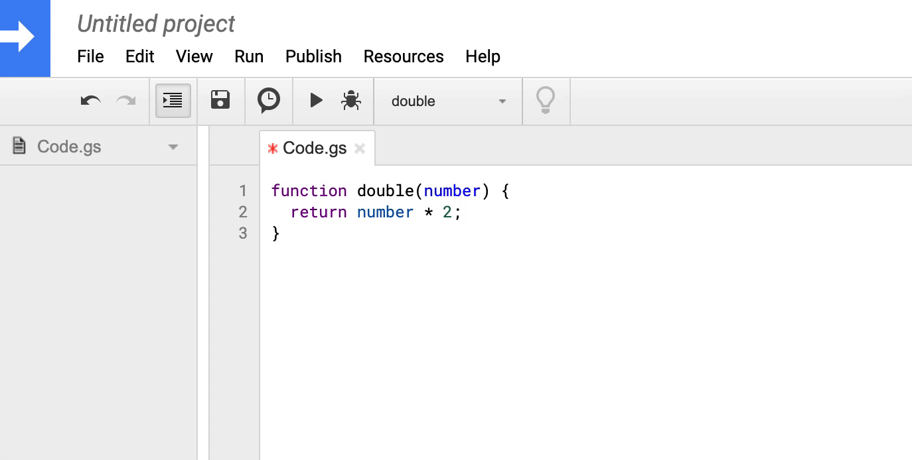

# Introduction
We all know how much marketers love spreadsheets. They're versatile, allow for quick analyses and no coding is required.

They're also often used as internal dashboards to measure and track the performance of ads.

But did you know it was possible to use JavaScript to run scripts inside Google Spreadsheets? A little known feature even allows us to write our own custom spreadsheet functions that can be used in any cell of any sheet.

This is the feature from Google Apps Scripts we're going to use to automatically pull Facebook Ads data directly in our spreadsheets.

# How to Access Google Apps Scripts?
First, let's create a fresh Google Spreadsheet using the handy [sheet.new](https://sheet.new) URL, or navigate to your day-to-day marketing dashboard.

You should see an empty Google Spreadsheet, as below.


Next, click on: __Tool > Script Editor__


A new browser window should have opened showing Google Apps Script's IDE (code editor) with an empty `myFunction`.


Note that Google Apps Scripts does not support ES6 but older versions of JavaScript only.

# Discovering Google Apps Script
## Hello, World! in Google Apps Script
Let's do a quick "Hello, World!" in Google Apps Script.

One of the main differences from vanilla JavaScript is that logging isn't done by `console.log()` but `Logger.log()` instead.

Insert `Logger.log('Hello, World');` in the "base" function:
```javascript
function myFunction() {
  Logger.log('Hello, World!');
}
```

Hit save 💾 or use the Ctrl/Cmd + S shortcut.

Next, run the script ▶️.

Go to View > Logs or use the Ctrl/Cmd + Enter shortcut to open the Logs window.

Congrats, you've run your first Google Apps Script!


## Custom Function Basic Example
Let's do a very simple custom function to show how it's possible to create our own personal functions in Google Spreadsheet.

Replace the code in the Google Apps Script code editor to be:
```javascript
function double(number) {
  return number * 2;
}
```

The goal of the function is to return the double of the number used as input.

Hit save 💾 and try your new spreadsheet function:


Congrats, you've just augmented your Spreadsheet with the power of JavaScript!

## How to make HTTP(S) request
Now let's get to serious business: making external API calls.

We'll be using [UrlFetchApp](https://developers.google.com/apps-script/reference/url-fetch/url-fetch-app) from Google Apps Script.

The most basic example of an HTTP request using `UrlFetchApp` in Google Apps Script is:
```javascript
function FBInsights() {
  var response = UrlFetchApp.fetch('https://example.com');

  Logger.log(response.getContentText());
}
```

Hit save 💾 and you should see an authorization as it's the first time we're running a script capable of querying external data.

Click on __Review Permissions__ when the window prompts you.


Click on __Advanced__ and then __Go to {project name} (unsafe)__ (it is safe since you're the project creator).


Click on __Allow__.


As you can see above, we've got the full HTML response of a GET query to `example.com`.

Let's do the real thing using Facebook Insights API.

# Querying Facebook Insights API
## Authenticating
Facebook Marketing API needs a way to authenticate yourself so that you and only you can access your data.

You will need to get an access token. You can read my article [Getting Started with Facebook Marketing API](/blog/getting-started-with-facebook-marketing-api) to learn how to get one.

Example of logging Facebook Insights data from yesterday:
```javascript
function FBInsights(entity_id) {
  var access_token = 'REPLACE_BY_YOUR_ACCESS_TOKEN';
  var url = 'https://graph.facebook.com/v5.0/'
    + entity_id
    + '/insights'
    + '?date_preset=yesterday'
    + '&access_token=' + access_token

  var response = UrlFetchApp.fetch(url);
  var json = response.getContentText();
  var data = JSON.parse(json);

  return data;
}

function run() {
  Logger.log(FBInsights('act_XXXXXXXXXXXXXXXX'));
}
```

Notice how since Facebook's response is in JSON we are using `JSON.parse()` to parse the response.

Do not forget to replace the `access_token` by your own access token and to add your own Facebook account ID when `FBInsights()` is called inside `run()` (or any other entity ID, like a campaign ID or an ad set ID).

A `run()` function is needed to wrap the `FBInsights()` function to be able to run it with parameters. Do not forget to switch the function to be run by `run()` before clicking on ▶️.


Open Logs and you should see data for your entity from yesterday.


## Query With Custom Dates
Let's tweak our existing script in order to be able to use a custom date:

```javascript
function FBInsights(entity_id, date) {
  var access_token = 'REPLACE_BY_YOUR_ACCESS_TOKEN';
  var url = 'https://graph.facebook.com/v5.0/'
    + entity_id
    + '/insights'
    + '?time_range=' + encodeURIComponent(JSON.stringify({'since': date, 'until': date}))
    + '&access_token=' + access_token

  var response = UrlFetchApp.fetch(url);
  var json = response.getContentText();
  var data = JSON.parse(json);

  return data;
}

function run() {
  Logger.log(FBInsights('act_XXXXXXXXXXXXXXXX', '2020-01-20'));
}
```

Facebooks Insights API uses an object in the format of `{'since': YYYY-MM-DD, 'until': YYYY-MM-DD}` for the `time_range` parameter. `JSON.stringify()` is used to transfrom a native JS object to JSON, which we then wrap around using `encodeURIComponent()`.

By using the same date in `since` and `until` we're getting the results for that one day.

## Select Field
```javascript
function FBInsights(entity_id, date, field) {
  var access_token = 'REPLACE_BY_YOUR_ACCESS_TOKEN';
  var url = 'https://graph.facebook.com/v5.0/'
    + entity_id
    + '/insights'
    + '?time_range=' + encodeURIComponent(JSON.stringify({'since': date, 'until': date}))
    + '&fields=' + field
    + '&access_token=' + access_token

  var response = UrlFetchApp.fetch(url);
  var json = response.getContentText();
  var data = JSON.parse(json);

  return parseFloat(data['data'][0][field]);
}

function run() {
  Logger.log(FBInsights('act_XXXXXXXXXXXXXXXX', '2020-01-20', 'spend'));
}
```

This adds `field` as a function parameter, adds the necessary query parameter in the URL and tweaks the `return` statement to only return the data from that specific `field`, parsed as a float.

To know more about all possible fields, please refer to my [Guide to Facebook Insights API](/blog/guide-facebook-insights-api).

# Final demo
You can now use `=FBInsights("entity_id", TEXT("date", "yyyy-mm-dd"), "field_name")` in your Spreadsheets! `=TEXT()` is useful to convert any date into the `YYYY-MM-DD` format required by Facebook.

Here is an example to retrieve spend for dates in column A. Formula I'm using in the example below: `=FBInsights("REPLACE_BY_YOUR_ENTITY_ID", TEXT(A2, "yyyy-mm-dd"), "spend")`


Now try it yourself with different fields (clicks, impressions...)!

PS: For the purpose of this article I added `* Math.random()` in my return statement to multiply my spend numbers by a random number in order to obfuscate what my real spend data is.

# Conclusion
Not only have you learnt how to create your own personal Google Spreadsheet function, but you've also learnt how to query Facebook's Marketing API & Insights API. Combining the two allows you to query your Facebook Ads data directly from Google Spreadsheet.

If you would like to do something similar with Google Ads data, please go read [Connecting Google Ads Scripts with Google Spreadsheets](/blog/adwords-google-spreadsheets).

Do not hesitate to [contact me](/about) with any questions about the article.
